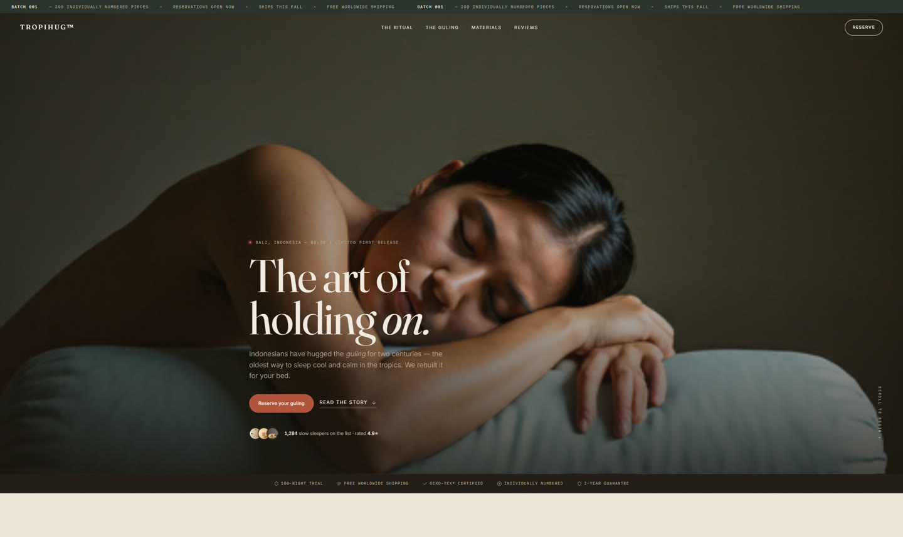

# TropiHug™

> The art of holding on. The Indonesian *guling*, reimagined.

An editorial, conversion-focused landing page for **TropiHug™** — a premium direct-to-consumer sleep brand built around the Indonesian *guling* (bolster / body pillow). The page is styled as a real, live storefront reserving its first production batch, with the actual conversion routed to a **waitlist / soft-preorder** capture (no payment backend).

> **Note:** TropiHug™ is a fictional brand created as a design/portfolio piece. No real products are sold and no payments are collected. Material and certification claims are written to be FTC-plausible for realism, not as endorsements.

## Preview

**Live:** [tropihug.pages.dev](https://tropihug.pages.dev)



**Full-page capture** (all 16 sections, top to bottom): [`docs/preview-full.jpg`](docs/preview-full.jpg)

---

## What it is

- A single-page storefront that **feels like a real brand**: price, variants, ratings & reviews, trust badges, batch scarcity, FAQ.
- Primary action: **reserve a numbered guling** → email capture → a thank-you page that acts as a **referral growth loop** (queue position + share link).
- Research-informed: waitlist conversion best-practice, premium sleep-DTC teardowns, and Mobbin visual patterns.

---

## Tech stack

- **Pure HTML5 / CSS3 / vanilla JS** — no framework, no build step.
- **[Motion.dev](https://motion.dev)** (CDN) for scroll reveals & parallax — the page degrades gracefully and works fully without it.
- Fonts: **Fraunces** (serif display), **Inter** (body), **JetBrains Mono** (labels).
- Accessibility & performance: semantic markup, `prefers-reduced-motion` guard, lazy images, no horizontal scroll, mobile drawer nav, `Product` JSON-LD.

---

## Sections

1. **Announce bar** — batch scarcity marquee
2. **Nav** — transparent → solid on scroll, mobile drawer
3. **Hero** — cinematic, context chip, dual CTA, social proof
4. **Trust strip** — trial / shipping / certification / guarantee
5. **The Ritual** — slow-scroll narrative
6. **Origin** — guling heritage (cooling-by-airflow, kapok)
7. **The Guling (PDP)** — benefits, price, swatches, reserve, live stock
8. **Material label** — spec grid + certification cluster (FTC-safe copy)
9. **Stack vs. Hug** — spine-alignment education
10. **Colours of the Earth** — horizontal cover collection with prices
11. **The Journey Home** — shipping steps
12. **Real rituals** — UGC masonry + testimonial
13. **Reviews** — rating summary + verified reviews
14. **FAQ** — preempts real objections
15. **Reserve** — email capture with inline success swap
16. **Footer** — link columns, socials, payment badges, oversized wordmark

---

## Design tokens (excerpt)

```css
--paper:  #f6f1e8;   /* warm cream background — no pure white */
--ink:    #211b14;   /* warm near-black text */
--forest: #29332b;   /* dark sections */
--clay:   #b0533a;   /* primary accent / CTAs (~5% of surface) */
--sage:   #8fa89b;   /* product accent */
```

Palette is deliberately warm/earthy (avoids the blue-purple "AI default" band); a paper-grain overlay and restrained motion reinforce a hand-made, editorial feel.

---

## Getting started

```bash
# any static server
python -m http.server 8000
# then open http://localhost:8000
```

---

## Form handling

The reserve form (`main.js`) validates email client-side, stores reservations in `localStorage`, assigns a mock queue position, and redirects to `thank-you.html?pos=…`. The thank-you page reads the position and generates a shareable referral link. To connect a real backend, replace the mock persistence block in `WaitlistForm`/`initForm` with a `fetch()` to your endpoint.

---

## Project structure

```text
tropihug/
├── index.html             # Landing page — 16 sections, semantic HTML5
├── thank-you.html         # Post-reserve: queue position + referral share loop
├── styles.css             # Design tokens + all styling (~780 lines, no framework)
├── main.js                # Motion.dev reveals, nav, swatches, form (progressive)
├── assets/                # Self-hosted images (hero, covers, product, gallery)
├── docs/
│   ├── preview-hero.jpg   # Above-the-fold capture
│   ├── preview-full.jpg   # Full-page capture
│   └── design-reference/  # Original Google Stitch export (v0 provenance)
├── AGENTS.md              # How this was built — human × AI process log
├── LICENSE                # MIT
└── README.md
```

---

## License

MIT — see [LICENSE](LICENSE).

**Built as a portfolio piece.** [lemburlab.com](https://lemburlab.com) · [@lemburlab](https://github.com/lemburlab)
